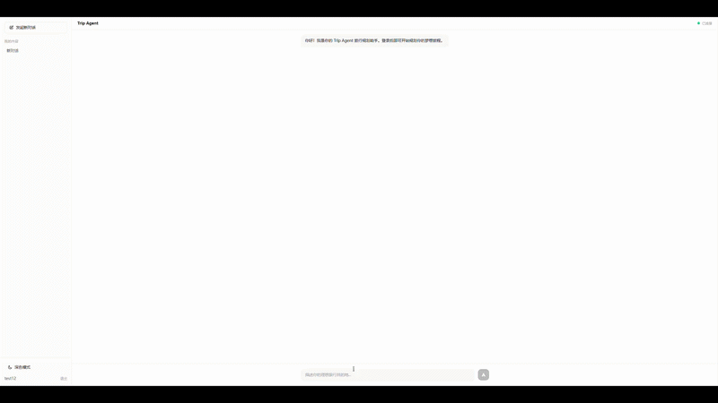
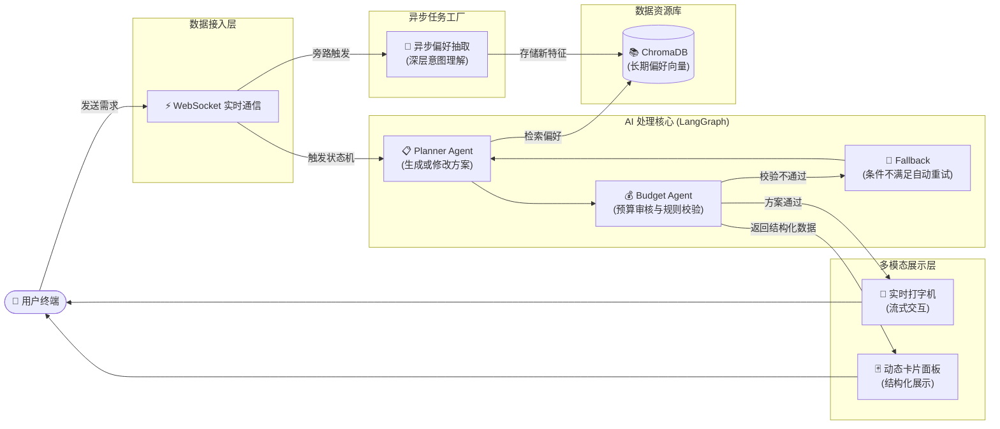
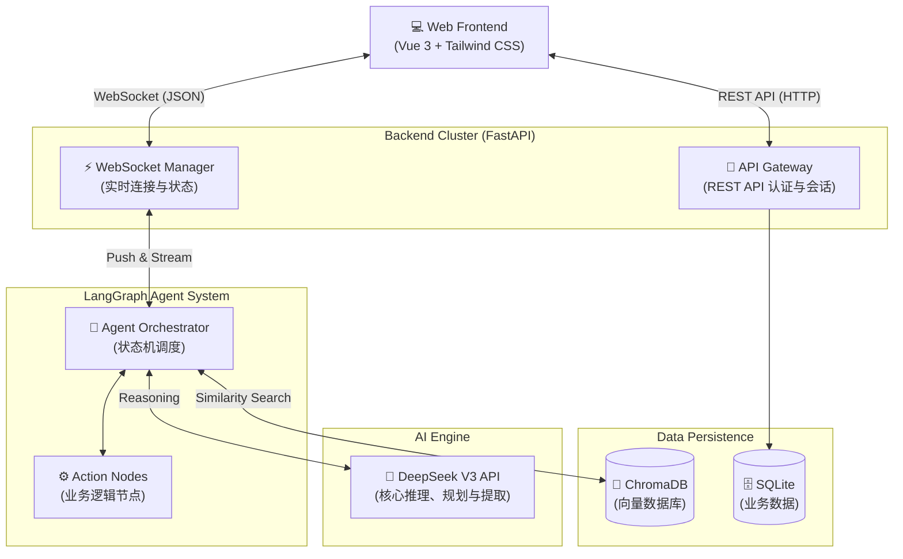

# Vibe Travel Pilot (Trip Agent) 🌍✈️

## 🌟 项目演示 (Demo)

## 📌 项目背景与初衷 (Background & Purpose)

在当前的大模型应用中，单体 Agent 往往难以兼顾“发散性的创意规划”与“收敛性的严格审查”。为了突破这一瓶颈，**Trip Agent (Vibe Travel Pilot)** 诞生了。

本项目最初的设定是一个探索性的**多智能体博弈 (Agent-to-Agent Negotiation)** 实验。目的是打造一个具备**自我约束、自我纠错能力，且拥有时间线记忆**的自动化旅行规划专家系统。我们不仅仅满足于让 AI 生成一段干瘪的文本，而是希望构建一个类似于真实旅行社的运作流：一个充满创意的**规划师 (Planner)** 负责天马行空，一个严厉的**预算审计员 (Budget Inspector)** 负责把关，两者在这个沙盒中自动进行多轮内部辩论，直到出具一份完美契合用户（既要求奢华又要求性价比，或“预算无上限”等各种特殊 Vibe）的最终行程单。

## 💡 核心价值与意义 (Significance)

本项目的成功落地具有以下几个重要的技术标杆意义：

1. **解决 Multi-Agent 典型的“死循环”与“幻觉”痛点**
   传统的多智能体对话极易陷入无限争吵。本项目通过在 LangGraph 状态机中引入 `MAX_ROUNDS` 阻断机制与 **Explicit Constraint Injection (显式约束注入)**（审计员不仅能 Reject，还必须在 Feedback 中精准指出超标项），迫使 Planner 在下一轮生成时带着“紧箍咒”定向修改，完美展示了如何构建收敛的 A2A 协议。
   
2. **打通 MCP (Model Context Protocol) 实时数据枢纽**
   规划师不再是“凭空想象”，而是通过挂载内部的 `travel_mcp_server.py`，实时拉取景区的真实排队时长和票价数据。它证明了即使是基于 API 的大模型，也能通过外部工具锚定物理世界的客观现实。

3. **零成本的 Serverless 全栈云原生架构验证**
   本项目没有使用沉重的商业微服务集群。前端采用 Vue 3 + Tailwind (Glassmorphism 极致 UI)，后端采用 FastAPI 提供高性能 WebSocket 全双工通信。最关键的是，我们将构建好的前端静态文件直接挂载到 FastAPI 的根路由上，使得**只需一个极其轻量的 Dockerfile 容器**，就能完美部署在 HuggingFace Spaces 白嫖的免费硬件上，供全网用户访问。

4. **无缝的 Native Voice 语音交互集成**
   放弃了沉重的后端音频流转方案，巧妙利用浏览器的底层 AI 算力 (**Web Speech API** 的 `SpeechRecognition` 与 `SpeechSynthesis`)。从语音实时搜集指令，到 Agent 生成最终行程单后 TTS 自动语音播报，打通了“所说即所指”的沉浸式体验链条，探索了前端极简语音多模态的新范式。

## ⚙️ 架构概览 (Architecture)

*   **大语言模型驱动**: DeepSeek (原计划 Gemini，后因网络及推理速度切至 DeepSeek API，性价比与逻辑能力双绝)。
*   **状态与编排**: LangGraph (图驱动的 State 传递)。
*   **长短期记忆网络**: 
    *   *短期*: WebSocket 会话级别的 `chat_sessions` 上下文轮转。
    *   *长期*: 基于 ChromaDB 的本地向量库（支持挂载云盘持久化）。
*   **交互前端**: Vite + Vue 3，提供极具黑客与极客美学的赛博朋克深色 UI，支持 Text/Voice 双模热切换。

## 🚀 部署指南 (Deploy locally or on HF Spaces)

### 1. 本地运行 (Local Dev)
1. 克隆代码库：`git clone https://github.com/sisfus1/trip_agent.git`
2. 基础环境：`Python 3.11+` 以及 `Node.js 18+`
3. 终端配置 API Key：`set DEEPSEEK_API_KEY=your_key`
4. 运行后端 (端口 8000)：`cd backend && uvicorn main:app --reload`
5. 运行前端 (端口 5173)：`cd frontend && npm install && npm run dev`

### 2. HuggingFace Spaces 一键部署
1. 在 HF 创建空白空间，SDK 选择 **Docker**。
2. 将此代码库打包全量推送到 Space。
3. 在 Space 的 **Settings -> Variables and secrets** 中配置 `DEEPSEEK_API_KEY`。
4. HF 自动解析根目录的 `Dockerfile` 构建并暴露 7860 端口，开启服务！

## 🗺️ 业务流程图 (Business Flow)

## 🏗️ 技术架构图 (Technical Architecture)

---
*Developed with System 2 analytical thinking & Antigravity IDE.*
